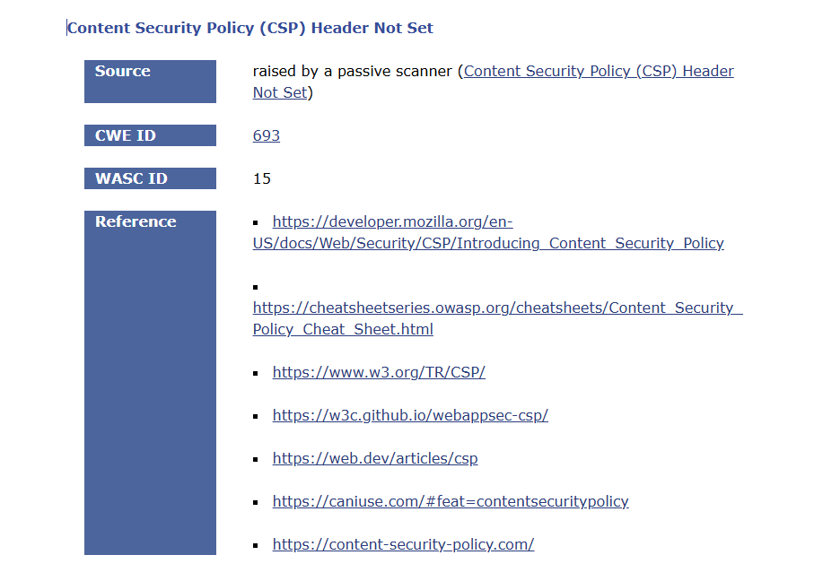
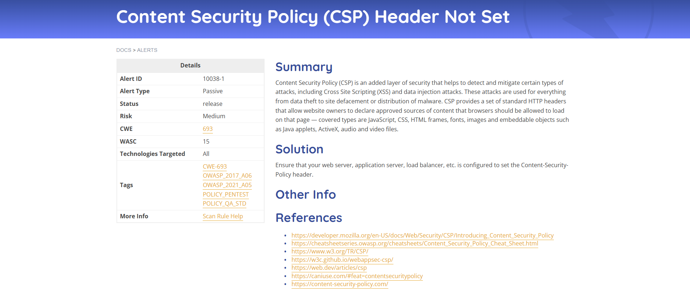
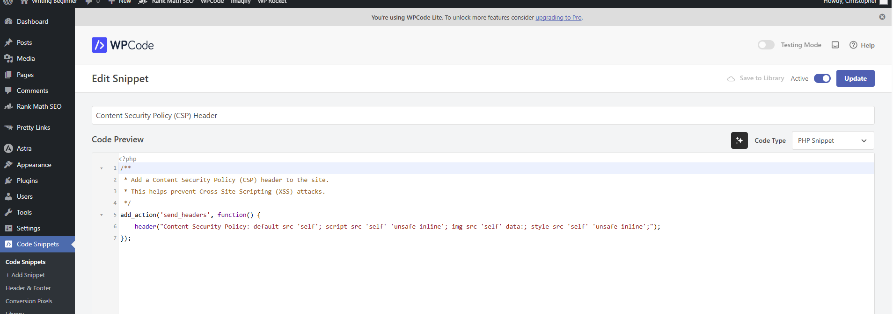
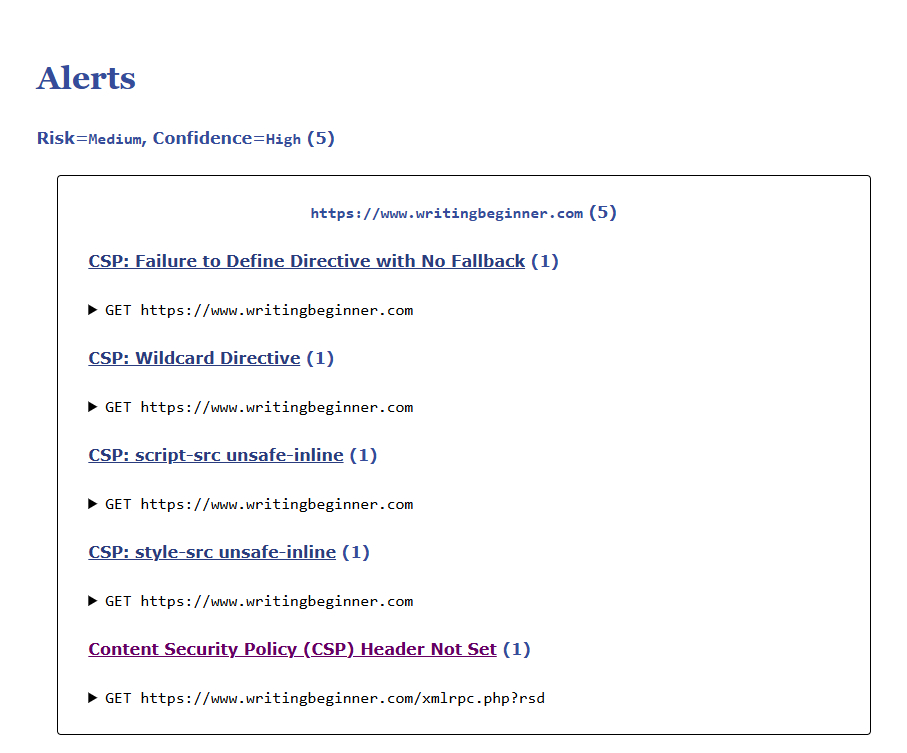

Project 2: Web Application Vulnerability Scan & Remediation

Executive Summary

This report details a web application security assessment performed on a live WordPress site (writingbeginner.com) using the OWASP ZAP DAST scanner. The initial scan identified several medium-risk vulnerabilities, with the most critical being a missing Content Security Policy (CSP) header. A remediation plan was executed by creating a custom PHP code snippet to implement a baseline CSP. A verification scan confirmed that the primary finding was successfully remediated, demonstrating the ability to identify, analyze, and resolve application-level security weaknesses.

Objective

To use a Dynamic Application Security Testing (DAST) tool to identify common web application vulnerabilities, analyze the findings against the OWASP Top 10, and implement a technical control to mitigate the identified risk.

Tools Used

OWASP ZAP: An industry-standard DAST scanner for finding web application vulnerabilities.

WordPress & Code Snippets Plugin: As the platform for implementing the remediation code.

Phase 1: Initial Scan & Findings

An automated scan was conducted using OWASP ZAP to establish a baseline security posture for the application. The scan was configured to spider the site and actively attack it to find vulnerabilities.

Initial Challenge: WAF Intervention
The initial scan attempt failed with a "Connection reset" error. This indicated that the Web Application Firewall (WAF) at the hosting level (WPX/Cloudflare) correctly identified the scan as potentially malicious traffic and blocked my IP address. After contacting the host to whitelist my IP, a second block was encountered at the application level by the Wordfence plugin. This was resolved by whitelisting my IP directly in Wordfence. This multi-layered defense is a positive security feature of the site.

Key Finding: Content Security Policy (CSP) Header Not Set

After successfully whitelisting my IP, the scan completed. The most significant finding was a Medium-risk alert for "Content Security Policy (CSP) Header Not Set." A CSP is a critical defense-in-depth mechanism that helps prevent Cross-Site Scripting (XSS) and other code injection attacks by specifying which sources of content (scripts, styles, images) are trusted by the browser.

Phase 2: Remediation

The remediation plan focused on implementing a baseline CSP header. Instead of using a dedicated plugin, a more technical approach was chosen to demonstrate coding proficiency. A custom PHP function was created using the "Code Snippets" plugin to add the header directly.

Remediation Action: Implementing a CSP Snippet

The following PHP code was added and activated, which instructs the server to send a basic CSP header with every page load.

Phase 3: Verification

After the code snippet was activated, a final verification scan was performed with OWASP ZAP to confirm the effectiveness of the remediation.

Verification Result: Successful Remediation

The "after" scan report confirmed that the "Content Security Policy (CSP) Header Not Set" alert was successfully resolved for the main application. The presence of the header generated new, more specific informational alerts (e.g., CSP: script-src unsafe-inline), which is expected behavior. These new alerts represent opportunities for future hardening but confirm that the primary vulnerability has been fixed.

Final Outcome

This project successfully used a DAST scanner to identify a critical missing security header. The vulnerability was remediated by developing and deploying a custom PHP code snippet, and a verification scan confirmed the fix was successful. This demonstrates an end-to-end process of application vulnerability management.

Core Competencies Demonstrated

DAST Scanning: Proficiency in using OWASP ZAP to conduct automated web application security scans.

Vulnerability Analysis: Ability to analyze scan reports, prioritize findings based on risk, and understand their impact (OWASP Top 10).

Incident Response: Experience in troubleshooting and resolving scanner blocks from WAFs and other security systems.

Technical Remediation: Ability to write and implement custom code (PHP) to resolve a security vulnerability.

Verification: Understanding the importance of re-scanning to confirm that a fix is effective.
