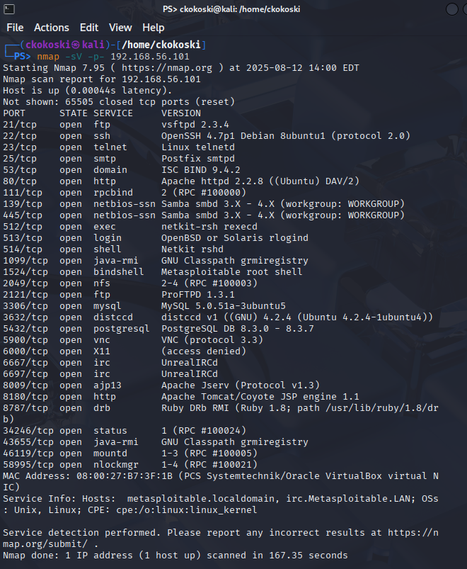
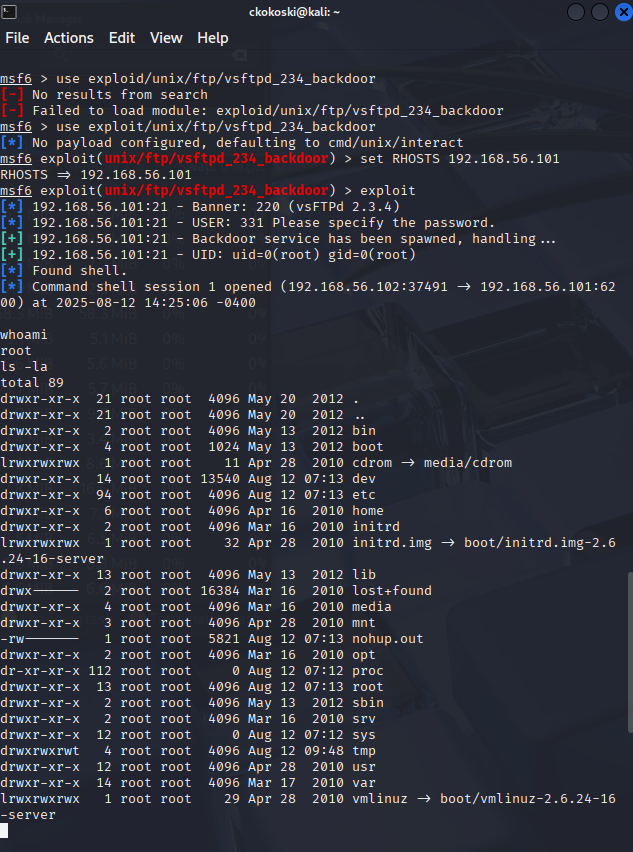

# Project 3: Network Penetration Test

## Executive Summary

This report details a penetration test conducted against a deliberately vulnerable Linux server (`Metasploitable2`) in an isolated lab environment. The test followed a standard methodology of reconnaissance, exploitation, and post-exploitation. An initial Nmap scan identified a vulnerable FTP service (`vsftpd 2.3.4`). This service was successfully exploited using the Metasploit Framework, resulting in a remote command shell with **full root-level privileges**, demonstrating a complete system compromise.

## Objective

To identify and exploit a known vulnerability on a target system within a controlled lab environment. This project demonstrates the ability to follow a structured penetration testing methodology, from initial reconnaissance to gaining privileged access, using industry-standard tools.

## Tools Used

* **Kali Linux:** The attacker virtual machine.
* **Metasploitable2:** The target virtual machine.
* **Nmap:** For reconnaissance and service enumeration.
* **Metasploit Framework:** For exploitation and gaining a remote shell.

## Phase 1: Reconnaissance

The first phase focused on identifying potential attack vectors on the target machine (`192.168.56.101`). A comprehensive Nmap scan was performed from the Kali Linux attacker machine to enumerate all open ports and the specific versions of the services running on them.

* **Command:** `nmap -sV -p- 192.168.56.101`
* **Key Finding:** The scan revealed numerous open ports. The most promising target for initial exploitation was the FTP service running on port 21, identified as `vsftpd 2.3.4`. This specific version is widely known to contain a backdoor vulnerability.

## Phase 2: Exploitation

Based on the reconnaissance finding, the Metasploit Framework was used to exploit the `vsftpd 2.3.4` vulnerability.

* **Methodology:**
    * The Metasploit console (`msfconsole`) was launched.
    * The appropriate exploit module was selected: `exploit/unix/ftp/vsftpd_234_backdoor`.
    * The target IP address (`RHOSTS`) was set to `192.168.56.101`.
    * The `exploit` command was executed.
* **Result:** The exploit was successful, immediately opening a command shell session on the target machine.

## Phase 3: Post-Exploitation

After gaining initial access, the final phase was to confirm the level of access and demonstrate control over the compromised system.

* **Privilege Escalation & Verification:** The `whoami` command was executed, which returned `root`. This confirmed that the exploit provided immediate, full administrator-level privileges, meaning no further privilege escalation was necessary.
* **Demonstration of Control:** The `ls -la` command was run to list the contents of the root directory, proving the ability to interact with the target's file system.

## Final Outcome

The penetration test was a complete success. A critical vulnerability was identified through systematic reconnaissance and successfully exploited using the Metasploit Framework, resulting in a full system compromise with root access.

## Core Competencies Demonstrated

* **Reconnaissance:** Used Nmap for comprehensive service and version enumeration to identify attack vectors.
* **Vulnerability Identification:** Correctly identified a known vulnerable service based on scan results.
* **Exploitation:** Proficiently used the Metasploit Framework to select, configure, and launch an exploit.
* **Post-Exploitation:** Understood and performed basic post-exploitation techniques to verify access level (`whoami`) and demonstrate control (`ls`).
* **Penetration Testing Methodology:** Followed a structured, multi-phase approach to attacking a target.
