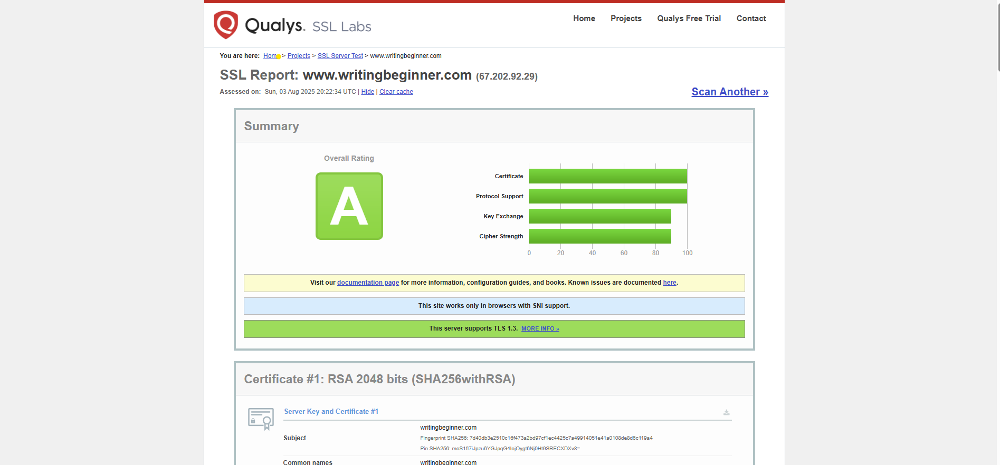
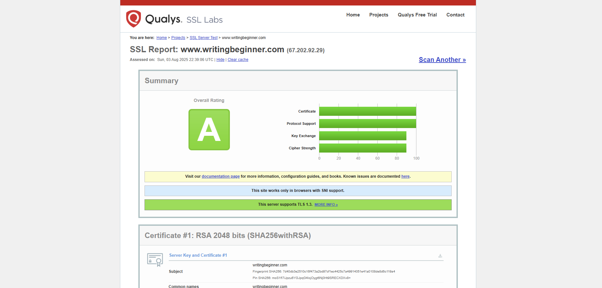

# Project 1: Live Web Application Security Audit & Hardening

### Executive Summary
This report details a security audit performed on a live web application (`writingbeginner.com`). The audit identified two key findings: the exposure of the insecure FTP protocol (Port 21) and a server misconfiguration that prevented the HSTS security header from being enabled. The FTP risk was mitigated via a compensating control, and the HSTS issue was escalated to the vendor with definitive, evidence-based analysis for resolution.

### Objective
To perform a security audit of a live production website (`writingbeginner.com`), identify vulnerabilities in its network and encryption configuration, and execute a remediation plan to harden the attack surface. This project demonstrates a full "Scan -> Remediate -> Verify" security lifecycle, including professional vendor interaction and root cause analysis of a complex server misconfiguration.

### Tools Used
* **Nmap:** For network discovery and port scanning.
* **Qualys SSL Labs:** For in-depth analysis of TLS/SSL configuration and vulnerabilities.
* **WSL (Ubuntu):** As the Linux environment for running command-line tools.

---

### Phase 1: Initial Reconnaissance & Findings

The initial phase focused on gathering baseline data to understand the website's current security posture from an external perspective.

**Finding 1: Insecure Services Exposed**
An Nmap scan (`nmap -F writingbeginner.com`) identified 9 open ports, with the most critical finding being Port 21/tcp (FTP) due to the protocol's insecure nature. FTP is an unencrypted protocol that transmits credentials in cleartext, posing a significant security risk if active user accounts exist.

**Finding 2: Incomplete Encryption Configuration**
A scan using Qualys SSL Labs was performed to assess the strength of the site's TLS/SSL implementation. While the site received a respectable overall grade of 'A', the detailed report identified a key weakness: **HTTP Strict Transport Security (HSTS) was not enabled.** HSTS is a critical security header that protects against protocol downgrade attacks and cookie hijacking by forcing browsers to use only secure connections.

---

### Phase 2: Mitigation & Vendor Interaction

Based on the initial findings, a remediation plan was developed, requiring interaction with the hosting provider (WPX).

**Action on FTP Risk:**
I first confirmed within the hosting control panel that **no active FTP user accounts existed**, which served as an immediate compensating control. I then submitted a support ticket to WPX requesting that port 21 be closed at the firewall level. The agent informed me this was a server-wide setting that could not be changed for an individual account. The risk from the open port was therefore **formally accepted**, with the lack of FTP users being the documented mitigating factor.

**Action on HSTS:**
I requested that WPX enable HSTS. The support agent initially replied that HSTS was already enabled and provided a screenshot of the site's `.htaccess` file as evidence, which did contain the HSTS header rule.

This created a critical discrepancy: the server's configuration file contained the rule, but external scanning tools proved the rule was not being applied in practice. Following a "trust, but verify" methodology, I initiated a second verification scan to gather definitive evidence.

---

### Phase 3: Verification & Root Cause Analysis

The final phase involved re-running the scans to validate the server's real-world behavior against the agent's claims.

**Nmap Verification:**
A second `nmap` scan confirmed the agent's statement: port 21 remained open, validating the decision to accept this as a systemic constraint.

**SSL Labs Verification & Root Cause:**
The SSL Labs scan was re-run with the cache cleared. The new report **proved that HSTS was still not enabled**, despite its presence in the `.htaccess` file.

This evidence pointed to a more complex issue: a **server-level misconfiguration**. The `.htaccess` file, which is used by Apache web servers, was likely being ignored or overridden by a higher-level Nginx reverse proxy server, a common architecture used by managed hosts like WPX for performance. The HSTS rule existed but was never being processed.

I escalated the issue back to the support agent, providing a direct link to the live SSL Labs report as undeniable proof of the discrepancy.

---

### Final Outcome
This project successfully identified multiple security weaknesses and uncovered a nuanced server misconfiguration that was not immediately apparent even to the hosting provider's support team. The risk from the open FTP port was mitigated through a compensating control, and the critical misconfiguration preventing the HSTS security header from being applied was identified and escalated to the vendor with verifiable evidence for final resolution.

### Core Competencies Demonstrated
* **Vulnerability Identification:** Used industry-standard tools to find real-world security weaknesses.
* **Technical Analysis:** Interpreted scan results and configuration files to understand root causes.
* **Root Cause Analysis:** Diagnosed a complex issue involving conflicting server technologies (Nginx overriding Apache `.htaccess`).
* **Vendor Communication:** Professionally engaged with a third-party vendor to resolve security issues.
* **Evidence-Based Escalation:** Used data and tool-generated reports to challenge incorrect information and drive toward a resolution.
* **Risk Management:** Understood and applied the concept of a compensating control when a primary control was not feasible.
