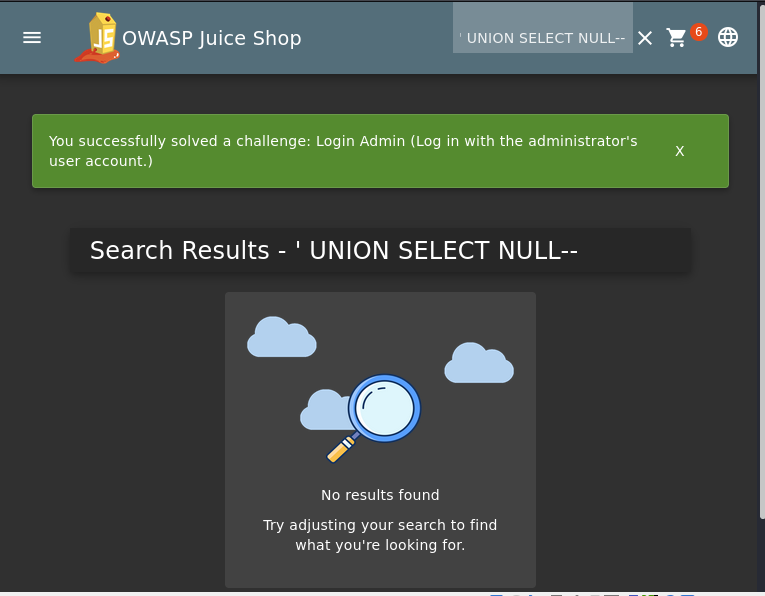
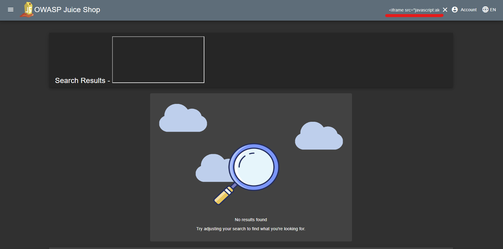
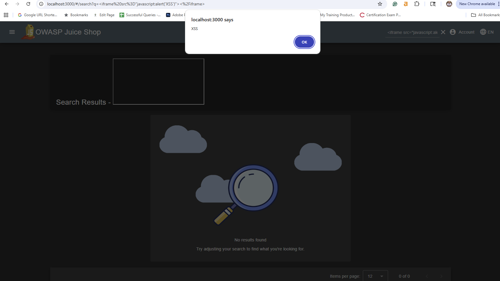

## Project 2: Practical Exploitation of the OWASP Top 10

### **Vulnerability 1: SQL Injection to Bypass Authentication**

**Description:** Conducted a web application penetration test against the OWASP Juice Shop, a deliberately insecure web application. The primary objective was to identify and exploit an authentication vulnerability to gain unauthorized access to a privileged account.

**Vulnerability Analysis:** The application's login form was found to be vulnerable to a classic SQL Injection attack. By injecting a crafted SQL statement (`' or 1=1--`) into the email parameter, the backend database query was manipulated to always return a true condition. This bypassed the password check entirely and granted access to the first user in the database, which was the administrator account. This vulnerability represents a critical risk, as it allows any unauthenticated attacker to gain full administrative control over the application.

### Skills Demonstrated:

* **Web Application Pentesting:** Executed a targeted test against a live web application in a controlled lab environment.
* **SQL Injection (SQLi):** Identified and manually exploited an authentication bypass vulnerability.
* **Vulnerability Analysis:** Analyzed the application's response to malicious input to understand the backend query structure and formulate a successful payload.
* **Privilege Escalation:** Escalated from an unauthenticated user to a full-access administrator.
* **Evidence Curation:** Captured and documented evidence of successful exploitation for reporting.

### Evidence:

The following screenshot shows the success message displayed immediately after the malicious payload was submitted, confirming a successful login as the administrator.

****

### **Vulnerability 2: Reflected Cross-Site Scripting (XSS)**

**Description:** Successfully executed a Reflected XSS attack by injecting a malicious JavaScript payload via an `<iframe>` tag into the product search bar. The server failed to properly sanitize the input, reflecting the script back to the browser, where it was executed.

**Vulnerability Analysis:** An attacker could use this vulnerability to steal session cookies from other users, perform actions on their behalf, or redirect them to a malicious website.

**Steps to Reproduce:**
    1. Navigated to the main shop page.
    2. Entered the payload `<iframe src="javascript:alert('XSS')"></iframe>` into the search input field.
    3. Submitted the search query.
    4. Observed a JavaScript alert box pop up, confirming script execution.

**Skills Demonstrated:**
* Web Application Pentesting
* Cross-Site Scripting (XSS)
* Input Validation Bypass
* Client-Side Attacks
* Payload Crafting

**Evidence of Exploitation:**
The following screenshots demonstrate the successful exploit. The first shows the malicious payload entered into the search bar, and the second shows the resulting JavaScript alert box executing on the page, confirming the XSS vulnerability.

